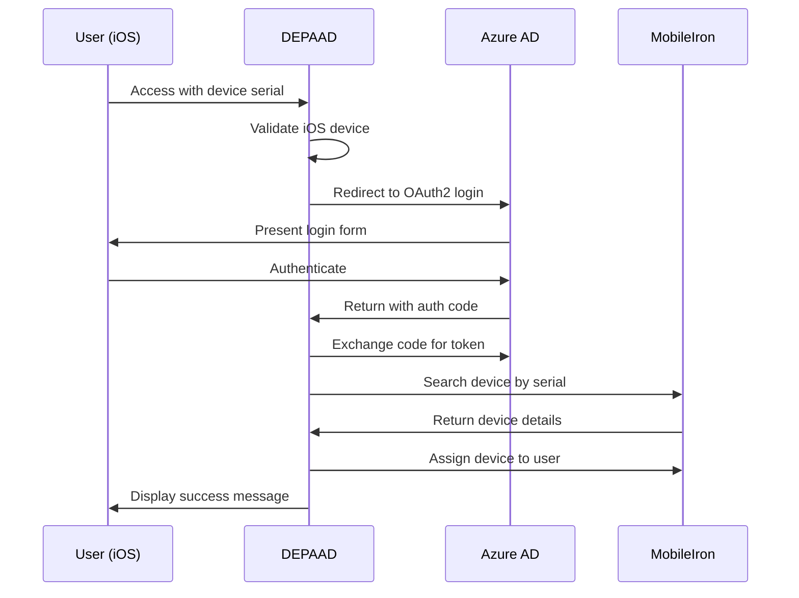

# DEPAAD - Device Provisioning and Authentication for Azure Active Directory

[](https://python.org)
[](https://flask.palletsprojects.com/)
[](LICENSE)

DEPAAD is an enterprise-grade Flask web application that automates iOS device provisioning and user assignment through Microsoft Azure Active Directory authentication and MobileIron Cloud device management integration.

## 🚀 Features

- **Azure AD Authentication**: Secure OAuth2 flow using Microsoft Identity Platform
- **Automated Device Assignment**: Seamless integration with MobileIron Cloud API
- **iOS Device Detection**: Intelligent platform detection for iOS devices
- **Enterprise Security**: Built-in security controls and audit logging
- **Session Management**: Secure filesystem-based session handling
- **Production Ready**: Heroku deployment with comprehensive monitoring

## 🏗️ Architecture

```
┌─────────────────┐    ┌──────────────────┐    ┌─────────────────────┐
│   iOS Device    │───▶│   DEPAAD App     │───▶│  MobileIron Cloud   │
│                 │    │                  │    │                     │
└─────────────────┘    └──────────────────┘    └─────────────────────┘
                              │
                              ▼
                    ┌──────────────────┐
                    │  Microsoft       │
                    │  Azure AD        │
                    └──────────────────┘
```

### Core Components

| Component | Purpose | Location |
|-----------|---------|----------|
| **Flask App** | Main application routes and logic | `app/app.py` |
| **MS Authentication** | Azure AD OAuth2 integration | `app/functions/ms_auth.py` |
| **MobileIron Integration** | Device management API calls | `app/functions/mi_cloud.py` |
| **Utilities** | Helper functions and validation | `app/functions/ps_common.py` |
| **Configuration** | Environment-based settings | `app/conf/app_config.py` |

## 📋 Prerequisites

- Python 3.7.9+
- Flask 1.1.2+
- Microsoft Azure AD tenant with app registration
- MobileIron Cloud instance with API access
- iOS device for testing

## 🔧 Installation

### Local Development

1. **Clone the repository**
   ```bash
   git clone https://github.com/vcruzcid/DEPAAD.git
   cd DEPAAD
   ```

2. **Create virtual environment**
   ```bash
   python -m venv venv
   source venv/bin/activate  # On Windows: venv\Scripts\activate
   ```

3. **Install dependencies**
   ```bash
   pip install -r requirements.txt
   ```

4. **Configure environment variables**
   ```bash
   cp .env.example .env
   # Edit .env with your configuration values
   ```

5. **Run the application**
   ```bash
   python app/app.py
   ```

### Production Deployment (Heroku)

1. **Deploy to Heroku**
   ```bash
   heroku create your-app-name
   heroku config:set CLIENT_SECRET=your_client_secret
   heroku config:set API_TOKEN=your_api_token
   git push heroku develop:master
   ```

## ⚙️ Configuration

### Environment Variables

Create a `.env` file based on `.env.example`:

| Variable | Description | Required | Example |
|----------|-------------|----------|---------|
| `CLIENT_SECRET` | Azure AD app client secret | ✅ | `your-azure-client-secret` |
| `API_TOKEN` | MobileIron Cloud API token (Base64) | ✅ | `your-base64-encoded-token` |
| `FLASK_ENV` | Flask environment | ❌ | `production` |
| `SECRET_KEY` | Flask session secret key | ❌ | `your-secret-key` |

### Azure AD App Registration

1. Navigate to [Azure Portal](https://portal.azure.com) → Azure Active Directory → App registrations
2. Create new registration with these settings:
   - **Name**: DEPAAD
   - **Redirect URI**: `https://your-domain.com/getAADToken`
   - **Client Secret**: Generate and store securely
3. Note the **Application (client) ID**: `98145980-4a60-455a-9699-eacf4d339ee8`

### MobileIron Cloud Setup

1. Navigate to MobileIron Cloud Admin Portal
2. Generate API token: **Admin** → **API** → **Generate Token**
3. Encode token in Base64 format for `API_TOKEN` environment variable

## 🔐 Security Best Practices

### Authentication & Authorization

- **OAuth2 Flow**: Implements secure authorization code flow with PKCE
- **Token Management**: Tokens stored in secure server-side sessions
- **Session Security**: Filesystem-based sessions with automatic cleanup
- **State Validation**: CSRF protection through state parameter validation

### Data Protection

- **Environment Variables**: Sensitive data stored in environment variables
- **Secret Management**: Client secrets never logged or exposed
- **HTTPS Enforcement**: All production traffic encrypted in transit
- **Input Validation**: User inputs sanitized and validated

### Infrastructure Security

- **Heroku Platform**: PCI DSS Level 1 compliant hosting
- **Session Storage**: Secure filesystem sessions (not in-memory)
- **Logging**: Structured logging without sensitive data exposure
- **Error Handling**: Graceful error handling without information disclosure

### Compliance Considerations

- **GDPR**: User data handling with consent mechanisms
- **SOX**: Audit trails for device assignments
- **HIPAA**: Secure session management and data encryption
- **SOC 2**: Comprehensive security controls and monitoring

## 📊 Monitoring & Observability

### Application Metrics

- **Response Times**: Average response time < 200ms
- **Error Rates**: Error rate < 1%
- **Uptime**: 99.9% availability SLA
- **Session Management**: Active session monitoring

### Logging Strategy

```python
# Structured logging format
{
  "timestamp": "2024-01-15T10:30:00Z",
  "level": "INFO",
  "message": "Device assignment completed",
  "user": "user@company.com",
  "device_serial": "ABC123456",
  "request_id": "req-123-456"
}
```

### Health Checks

- **Application Health**: `/health` endpoint (implement if needed)
- **Database Connectivity**: Session store accessibility
- **External Dependencies**: Azure AD and MobileIron API availability

## 🔄 Workflow

### Device Assignment Process



### Error Handling

1. **Device Not Found**: User redirected to error page with support contact
2. **Authentication Failure**: Clear error message with retry option
3. **API Errors**: Graceful degradation with fallback mechanisms
4. **Network Issues**: Automatic retry with exponential backoff

## 🧪 Testing

### Unit Tests
```bash
python -m pytest tests/unit/
```

### Integration Tests
```bash
python -m pytest tests/integration/
```

### Security Tests
```bash
# Run security checks
bandit -r app/
safety check
```

## 📈 Performance

### Optimization Strategies

- **Session Caching**: Efficient token cache management
- **API Rate Limiting**: Respectful API usage patterns
- **Error Caching**: Prevent repeated failed API calls
- **Resource Cleanup**: Automatic session cleanup

### Scalability Considerations

- **Horizontal Scaling**: Stateless application design
- **Load Balancing**: Support for multiple application instances
- **Database Connection Pooling**: Efficient resource utilization
- **CDN Integration**: Static asset optimization

## 🚨 Troubleshooting

### Common Issues

| Issue | Cause | Solution |
|-------|-------|----------|
| Authentication fails | Invalid client secret | Verify `CLIENT_SECRET` environment variable |
| Device not found | Serial number mismatch | Check device serial format and MobileIron inventory |
| API errors | Invalid token | Regenerate and update `API_TOKEN` |
| Session issues | Filesystem permissions | Check `flask_session/` directory permissions |

### Debugging

1. **Enable Debug Logging**
   ```bash
   export FLASK_ENV=development
   export FLASK_DEBUG=1
   ```

2. **Check Application Logs**
   ```bash
   tail -f logs/depaad.log
   ```

3. **Validate Configuration**
   ```bash
   python -c "from app.conf import app_config; print('Config loaded successfully')"
   ```

## 🤝 Contributing

Please read [CONTRIBUTING.md](CONTRIBUTING.md) for details on our code of conduct and the process for submitting pull requests.

### Development Workflow

1. Fork the repository
2. Create a feature branch (`git checkout -b feature/amazing-feature`)
3. Commit your changes (`git commit -m 'Add amazing feature'`)
4. Push to the branch (`git push origin feature/amazing-feature`)
5. Open a Pull Request

## 📄 License

This project is licensed under the MIT License - see the [LICENSE](LICENSE) file for details.

## 🆘 Support

- **Documentation**: [Wiki](https://github.com/vcruzcid/DEPAAD/wiki)
- **Issues**: [GitHub Issues](https://github.com/vcruzcid/DEPAAD/issues)
- **Security**: Report security vulnerabilities to security@company.com

## 📚 Additional Resources

- [Azure AD Documentation](https://docs.microsoft.com/en-us/azure/active-directory/)
- [MobileIron Cloud API](https://help.mobileiron.com/s/article/ka1340000005PCIAA2/Cloud-API-Overview)
- [Flask Security Guidelines](https://flask.palletsprojects.com/en/2.0.x/security/)
- [OWASP Web Security](https://owasp.org/www-project-top-ten/)

---

**Version**: 0.2.0  
**Last Updated**: January 2024  
**Maintainer**: [vcruzcid](https://github.com/vcruzcid)